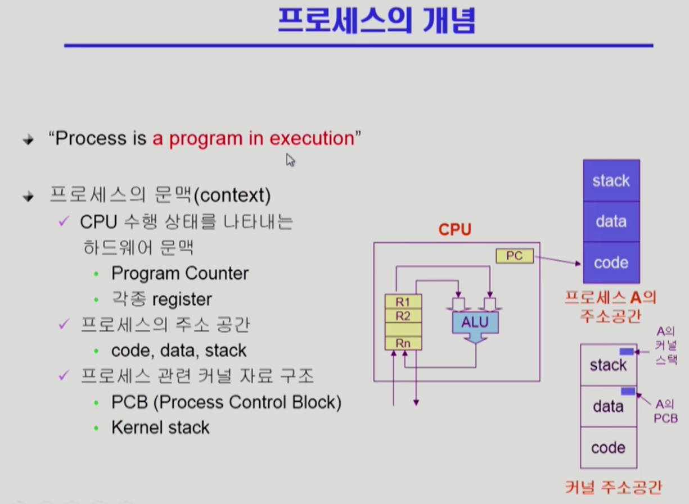

## 1. 프로세스란?
- Process is a program in execution.
- 프로세스는 실행 중인 프로그램을 의미한다. 

## 2. 프로세스의 문맥(context)과 교환(context switch)

### 1) 문맥
- cpu는 Program Counter의 주소를 통해 불러온 code를 register에 저장하고 register에 instruction에 따라 작업을 수행. 
- 한편, interrupt/trap 등 다양한 이유로 프로세스는 cpu의 점유를 포기하거나 빼앗김. 
- 작업하던 것을 정지하고 나중에 다시 작업하기 위해서는, 작업하던 내용과 경과과정을 저장하고, 이전에 작업했었던 내용을 cache memory에 불러와야 함(cache memory flush). 이러한 데이타를 문맥(context)이라 하며, cpu 점유의 변경을 문맥의 교환(context switch)라 함.
- 문맥은 PCB(Process Control Blcok)로서 저장되고, code가 수행한 값들은 Kernel stack에 저장된다. 

### 2) 문맥의 교환
- 문맥의 교환은 기존의 context를 저장하고, 다른 context를 불러오는 것을 의미함. 문맥의 교환을 하면 메모리의 Cache에 오버헤드를 발생.
- 문맥의 교환을 하지 않고 어떤 프로세스가 cpu의 권한을 놓는 경우가 있음. 그러니까 어떤 프로세스가 작업을 하는 도중에 I/O 디바에스에 접근이 필요해서 커널 모드로 변경하고 다시 유저모드로 돌아 왔을 때 cpu의 권한을 유지할 수 있다. 이를 트랩이라 하며, 문맥 교환이 아니다. 문맥 교환으로 인한 오버헤드가 발생하지 않는다. 

## 3. 프로세스의 상태 Process state와 큐queue
1) 프로세스의 상태
- New : 프로세스가 생성됨. 
- Running : CPU를 잡고 instruction을 수행 중.
- Ready : CPU를 기다림.
- Blocked (wait, sleep) : CPU를 사용할 수 없는 상태. I/O 이벤트를 수행하기 위하여 기다리는 것(I/O queue에 대기중)처럼, 프로세스의 입장에서는 작업 중이지만, ready와 running을 할 수 없음. 
-Terminated : 수행(Execution)이 끝난 상태. cpu의 반납. 

2) 프로세스의 상태의 변경 
- Device queue:  Running - > Blocked : 프로세스가 I/O 등의 이벤트를 수행해야 할 경우. 해당 프로세스는 해당 I/O 디바이스의 큐에 대기한다. 해당 디바이스의 컨트롤러의 지시에 따라 순서를 기다린다. 
- Ready queue: 
	-> Blocked - > Ready : 프로세스가 I/O 이벤트가 종료되어 CPU의 Instruction을 기다릴 경우. CPU의 queue에 해당 프로세스가 대기한다.
    -> New - > Ready : 새롭게 생성된 프로세스는 Ready 상태가 된다.
- Job queue : 현재 프로세스에 있는 모든 프로세스의 집합.
- 커널은 프로세스의 스케줄링을 담당. 커널는 커널 자신의 주소 공간 중 Data에 각 자원에 대한 queue를 자료구조형태로 가지고 있음. 커널은 이러한 데이타를 참고하여 프로세스의 상태를 변경.

## 3. 스케쥴러 Scheduler 의 종류
1) Shor-term scheduler(단기 스케쥴러, Cpu scheduler)
- 어떤 프로세스를 running 할지 결정

2) Long-term scheduler (장기 스케쥴러, job scheduler)
- 시작 프로세서(New) 중 어떤 것을 ready queue로 보낼지 결정.
- degree of Multiprogramming 제어
- time sharing system(현대의 시스템)에서는 사용하지 않음.
- 모든 new의 프로세스는 ready 상태가 됨.

3) Medium-term scheduler(중기 스케쥴러 or Swapper)
- 장기 스케쥴러를 대체.
- 프로세스의 생성에 초점을 맞추기 보다, 프로세스의 제거를 목표로 함.
- degree of Multiprogramming 제어

## 4. Suspended(Stopped) 프로세스 상태의 추가
- 중기 스케쥴러의 대두에 따라, 메모리를 정리하는 과정을 필요로 하며 이 상태를 Suspended라 함. 
- suspended 상태의 프로세스는, 스케쥴러에 의하여 작동이 정지되고 메모리로부터 제거(swap out)된 상태. (blocked 경우 divice queue에 대기하는 등 프로세스의 입장에서는 작업을 하는 중. blocked 와 suspended 는 프로세스의 종료 여부로 차이를 가짐. )
- 스케쥴러로 인해 다시 호출되는 경우 프로세스가 작동 가능. 메모리에 해당 데이타를 다시 불러와야 함(swap in).

> 사진 등 자료의 출처, 참고 자료 : http://www.kocw.net/home/search/kemView.do?kemId=1046323
이화여대 반효경 교수의 영상강의를 주요자료로 하여 운영체제를 학습하고 정리하고 있습니다.

