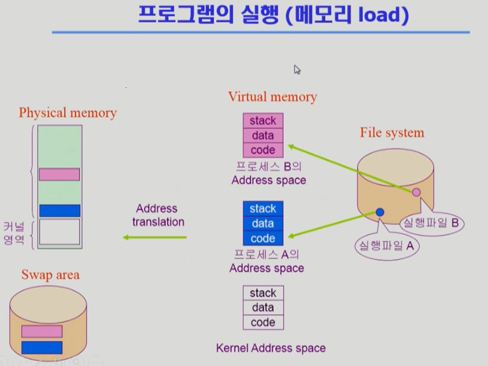

## 1. 프로그램의 실행 (memory load)
- I/O의 File System으로부터 작업하고자 하는 프로그램의 실행파일을 메모리에 로딩. 

### 1) virtual memory (논리 메모리)
- 프로그램을 모두 로딩하기에는 물리 메모리가 비싸고 용량이 부족. 이러한 물리 메모리의 용량의 한계를 해소하기 위하여 논리메모리를 사용.
- File System을 통해 보조 메모리(HDD/SDD)로부터 프로그램을 논리 메모리에 업로드. 프로그램이 저장되는 공간을 주소공간 Address Space이라 한다. index는 0부터 시작하며 해당 프로그램의 code, data, stack 등 을 가짐. 
- 논리 메모리는 다수의 사용자 프로그램과 하나의 커널로 이뤄짐. 커널의 경우 Kernel Address Space에 저장됨.
- 커널 주소 공간 Kernel Address Space에는 운영체제의 핵심 기능을 가지고 있다. 커널 주소 공간 중 code에는 cpu 등 컴퓨터의 자원 관리를 위한 코드와 시스템콜, 인터럽트 등이 있다. data에는 컴퓨터(CPU, Memory)와 I/O, 각 프로그램를 관리하기 위한 운영체제의 자료구조를 가지고 있다. Stack의 경우 각 사용자의 프로그램의 요구에 따른 작업을 위하여 각 각의 사용자 프로그램에 대한 스택을 가지고 있다. 

### 2) Physical momory(물리 메모리)
- 본격적으로 cpu와의 작업을 하기 위해 논리 메모리의 데이타를 물리 메모리로 불러옴. 모든 값을 불러오지 않고 필요로 하는 값만을 불러옴. 
- 물리 메모리에서 논리 메모리를 참조하기 위하여 Address Translation이 필요.
- 물리 메모리에서 더는 필요하지 않다고 판단한 메모리는 자동으로 삭제함. 재사용할 수 있지만 물리 메모리에서 계속 가지고 있기에는 큰 용량을 차지하는 데이타는 보조 메모리의 Swap area에 저장하며 미사용 시 휘발됨.

## 2. 프로그램의 시작과 종료, mode bit
- 프로그램이 시작되고 종료할 때 까지 사용자 모드(user mode, mode bit : 1)와 커널 모드(kernel mode, mode bit :0)의 연속으로 이뤄짐.
- 프로그램을 작동하는데 사용되는 함수는 1) 사용자 정의 함수 2) 라이브러리 함수 3) 커널 함수로 분류된다.
- 프로그램은 1)과 2)를 가지지만 3)을 가지지 못한다. 그러므로 커널 함수를 호출하기 위해서는, cpu의 단순한 주소값의 변경이 아닌, cpu의 통제권 자체를 바꿔야 함. 
- 프로그램은 시작과 종료까지 사용자 모두와 커널 모드의 cpu 통제권의 교환의 연속으로 이뤄짐. 

> 사진 등 자료의 출처, 참고 자료 : http://www.kocw.net/home/search/kemView.do?kemId=1046323
이화여대 반효경 교수의 영상강의를 주요자료로 하여 운영체제를 학습하고 정리하고 있습니다.

